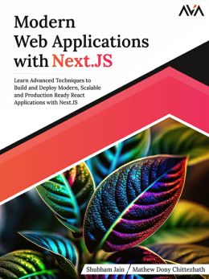

  <b>A tutorial in my <a href="https://github.com/abeerration/CS-Self-Education">CS Self Education</a> series</b>
  <h1>Next.js Development</h1>
  &nbsp;&nbsp;
  &nbsp;&nbsp;
  &nbsp;&nbsp;
  &nbsp;&nbsp;

---

## Prerequisites

None

## Description & Goals

This tutorial is about learning Next.js web app development (with JavaScript, Node.js, Express.js, MongoDB, React & Next.js).

---

## Materials

| # | Cover | Title |
| ----------- | ----------- | ----------- |
| **1.** |  | <h2>The Complete Developer</h2><h4>Master the Full Stack with TypeScript, React, Next.js, MongoDB, and Docker</h4><h4>No Starch Press</h4>
2024
 |
| **2.** |  | <h2>Modern Web Applications with Next.JS</h2><h4>Learn Advanced Techniques to Build and Deploy Modern, Scalable and Production Ready React Applications with Next.JS</h4><h4>Orange Education Pvt Ltd, AVA™</h4>
2023
 |

---

## Course Work

| # | Book | Code |
| ----------- | ----------- | ----------- |
| **1.** | The Complete Developer | [code](https://github.com/abeerration/Next.js-Development/tree/main/1.%20The%20Complete%20Developer) |
| **2.** | Modern Web Applications with Next.JS | [code](https://github.com/abeerration/Next.js-Development/tree/main/2.%20Modern%20Web%20Applications%20with%20Next.JS) |
